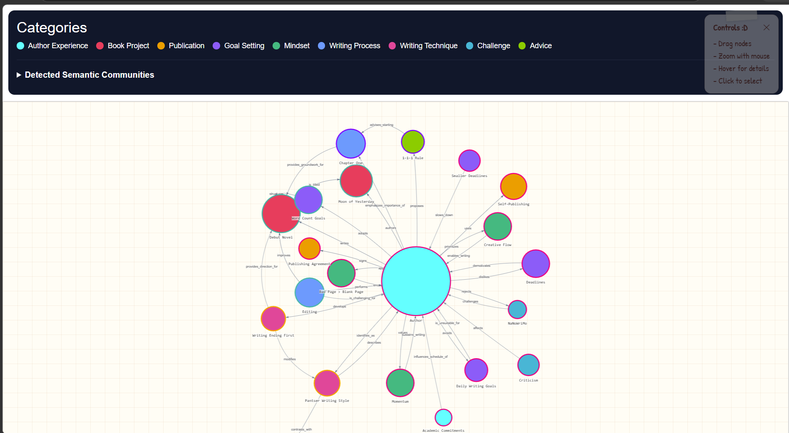
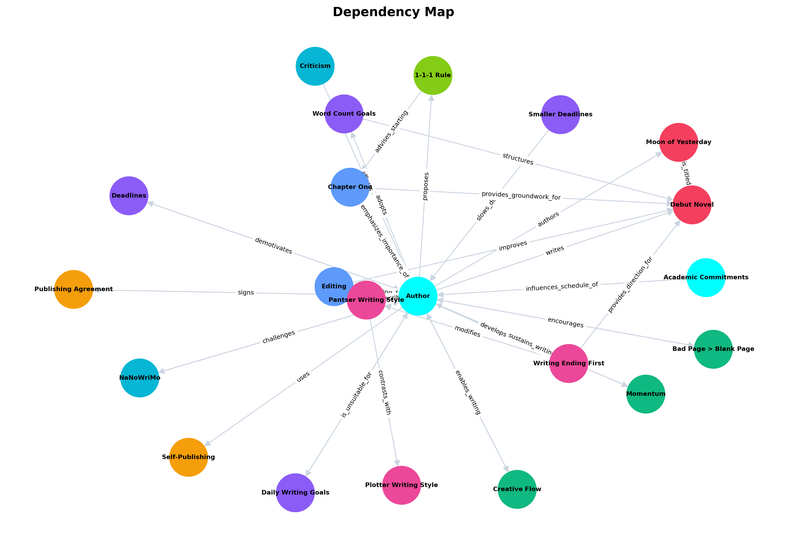
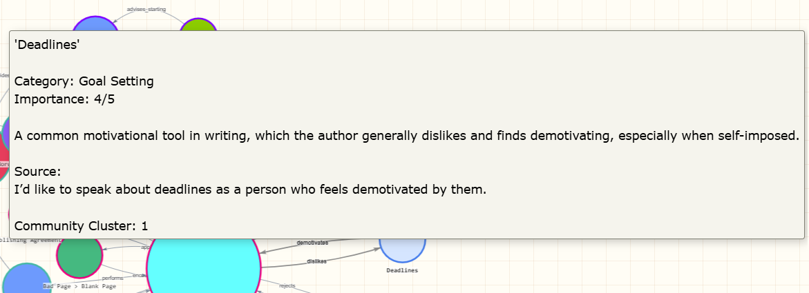
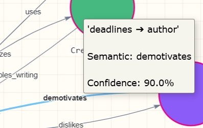
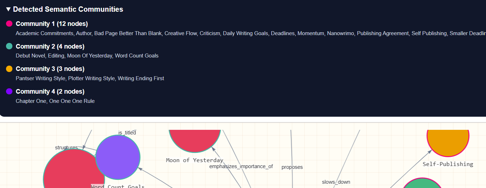
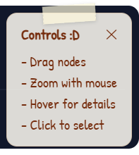
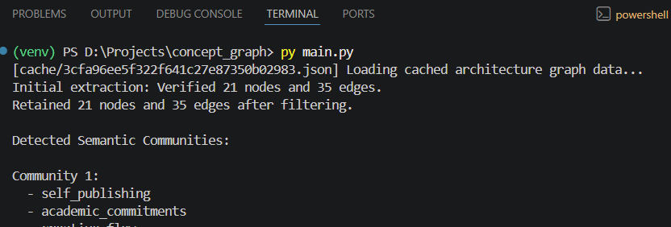

# Semantic Concept Graph Generator

Ever tried reading a massive block of text and wished you could just *see* how all the ideas, themes, and characters smash into each other?
(Literally smash into each other.)

This tool takes raw, unstructured text and uses **Gemini 2.5 Flash** to extract semantic concepts (meaningful entities, themes, emotions, concepts, and relationships from natural language text), validates them with **Pydantic**, crunches the mathematical clusters using **NetworkX**, and spins up an interactive network graph courtesy of **PyVis** (that you can play with thanks to the physics setting!).

<p align="center">
  
  
  
  
</p>
<p align="center">
  
  
</p>
<p align="center">
  <a href="https://semantic-graph-generator.vercel.app">
    
  </a>
</p>

---

## Quick TL;DR - What It Does

1. Reads raw text
2. Extracts semantic concepts using Gemini
3. Builds a knowledge graph
4. Detects communities and central concepts
5. Generates an interactive visualization

Input:
Article, chapters, research paper, design document, etc. (Save as `sample.txt` in main directory, adjust `MAX_INPUT_CHARS` in `main.py` as per your input - just be aware of the number of tokens you are using!)

Output:
Interactive semantic concept graph + static Matplotlib rendering of the same graph

> Interactive version available at:
> https://semantic-graph-generator.vercel.app

<table align="center">
<tr>
<td width="60%" align="center">

<br>
<b>Interactive Graph</b>
</td>

<td width="40%" align="center">

<br>
<b>Static Blueprint</b>
</td>
</tr>
</table>

---

## Features

> [!IMPORTANT]
> This README is admittedly long. Fortunately, this project was built to solve exactly that problem.
>
> Find the README summarized as a concept graph at: https://semantic-graph-generator.vercel.app/readme

### Semantic Extraction

Uses Gemini 2.5 Flash to identify nodes like characters, themes, events, technologies, settings and so on.
'Semantic' basically refers to meaning in context. Like the word 'bank' has several semantics: river bank or financial bank, you see. So, we want to find out what exactly the text is talking about - what is the semantic meaning of the words or the semantic relationship between words.

Each extracted node includes:

* Label
* Category
* Description
* Importance score
* Source reference

Have a look:


Then the system identifies semantic relationships between concepts and assigns a relationship type and a confidence score.



Low-confidence edges are automatically filtered to improve graph quality (minimum confidence of `0.55` required!).

(Yes, I'm demotivated by deadlines... Yes, Gemini is 90% confident.)

### Community Detection

NetworkX's modularity-based clustering algorithm groups related concepts into semantic communities (clusters). Community membership can be seen by the node border colors. These communities are mentioned under the collapsable section 'Detected Semantic Communities'.

This information, for most part, isn't very useful when you're trying to read something quickly. But it's nice to have, helps with visual correlations, and connects related concepts.



You see? Community 1 relates to writing in general, community 2 relates to my novel, community 3 relates to writing advice and styles, community 4 relates to... '1', haha. In my article I mention how the first week / first book / first idea and such are connected, so this wonderful digit has got its own nodes and community!

### Interactive Visualization

Built using PyVis.

Features include zooming, panning, node dragging, and hover tooltips with all the relevant relationship labels.

A static preview image is also generated using Matplotlib for documentation and sharing.

You can look at my sample outputs for this [article](https://medium.com/@prayasha/i-wrote-a-novel-without-learning-how-to-love-deadlines-11dfa5656c7f) I've written:

* `sample_graph.html`
* `sample_static_blueprint.png`

---

## Small Preview + Small Talk

This is the main output, a colorful concept graph with the information in a visual format with a lot of interactive elements built into it. It's a HTML file made primarily for larger screens (desktops, laptops, etc.).


You can zoom, drag nodes around, and explore the graph! Try downloading `samples/sample_graph.html` to get a feel.

For visual learners who struggle to take in large amounts of plain text, this is for you! You can also use transcripts as your sample; now, isn't that helpful?

I tried hard to make it very plain, so that it's not distracting, but also visually interesting so that it's not boring!
I thought to remove the hovering text since it was getting long (and perhaps a bit distracting?) and have it in a separate panel, but doing so was once again feeding information which was losing the main goal of this project: to the point summarization.

This little note on the top as my courtesy!!



The static graph struggles with many relationships and connections, which you can see here, but it is still very helpful if you just want to get to the point! Sometimes the interactive graph may feel like it gives too much information.


Ultimately, what matters is the condensation of information, one line summaries with their sources in the tooltip (the box that comes when you hover over a node or an edge), and the direction and connection between different pieces of information.

Also, the code filters out isolated nodes (points with no connection at all) - hopefully, no fun part (or serious part) gets skipped!

You are welcome to fine-tune this based on your requirements (keep isolated nodes, increase or decrease minimum required confidence for condensation or expansion of the graph, change the AI architecture from Google's Gemini to OpenAI's ChatGPT, tweak the prompt, among others).

P.S. I have added guardrails & fallbacks wherever possible. Check terminal for logs. Whatever you can't find on the screen is probably printed in here!



---

## Architecture

```text
Input Text
    │
    ▼
Gemini 2.5 Flash
    │
    ▼
Structured JSON Graph
    │
    ▼
Validation Layer
(Pydantic)
    │
    ▼
NetworkX Graph
    │
    ├── Centrality Analysis
    ├── Community Detection
    └── Graph Metrics
    │
    ▼
PyVis Visualization
    │
    ▼
Interactive HTML Graph
```

---

## Project Structure

```text
semantic-concept-graph/
│
├── cache/                  # Local JSON cache
│   └── *.json
│
├── samples/                # Repository documentation assets
│   ├── little_note.png
│   ├── sample_graph_screenshot.png
│   ├── sample_graph.html
│   └── sample_semantic_communities.png
│   └── sample_static_blueprint.png
│   └── sample_terminal_log.png
│   └── sample_tooltip_of_edge.png
│   └── sample_tooltip_of_node.png
│
├── sample.txt              # Feed your raw text data here!
├── main.py                 # The system core execution loop
├── graph.html              # Interactive DOM masterpiece
├── static_blueprint.png    # Matplotlib image asset
│
├── .env.example
├── .gitignore
├── requirements.txt
└── README.md
```

---

## Installation

### 1. Clone the repository

```bash
git clone https://github.com/prayasha-nanda/semantic-concept-graph.git
cd semantic-concept-graph
```

### 2. Create a virtual environment

```bash
python -m venv venv
```

Windows:

```bash
venv\Scripts\activate
```

Linux/macOS:

```bash
source venv/bin/activate
```

### 3. Install dependencies

```bash
pip install -r requirements.txt
```

### 4. Configure environment variables

Copy:

```bash
cp .env.example .env
```

Add your Gemini API key:

```env
GEMINI_API_KEY=your_api_key_here
```

---

## Usage

Place the text you want to analyze inside `sample.txt`.

Then run:

```bash
python main.py
```

Generated outputs:

```text
graph.html
static_blueprint.png
```

Open graph.html in your browser to explore the interactive graph!

---

## Caching

To reduce API usage and speed up experimentation, extraction results are cached locally.

Cache files are stored in cache/

The cache key is generated using the MD5 hash of **input text + prompt configuration**.

This ensures that changing extraction instructions automatically invalidates old cache results.

---

## Node Visualization

### Fill Color

Represents semantic category.

### Border Color

Represents detected community cluster.

Community clusters are generated using modularity-based graph analysis and indicate groups of closely related concepts.

### Node Size

Determined by:

* Importance score
* Graph centrality

Larger nodes generally represent more influential concepts.

---

## Tech Stack

- AI: Gemini 2.5 Flash
- Validation: Pydantic
- Graph Analysis: NetworkX
- Visualization: PyVis & Matplotlib
- Utilities: python-dotenv

---

## Example Use Cases
- Literature Analysis
- Research Papers
- Software Documentation
- Knowledge Mapping
- Visual Learning Use Cases

---

## Future Improvements

* Multi-document graph merging (mainly!)
* Export to GraphML
* Graph search and filtering
* Custom clustering strategies
* Perhaps a "talk to your graph" type bot?
* And maybe a UI update

---

## Built by yours truly...

Prayasha Nanda.

Initially started out as a fun experiment to see how structured (or unstructured!) my writing was, and then I built this fun way to summarize the content to make even 3,000 word articles interesting to explore!

## License
MIT License.

Copyright (c) 2026 Prayasha Nanda
